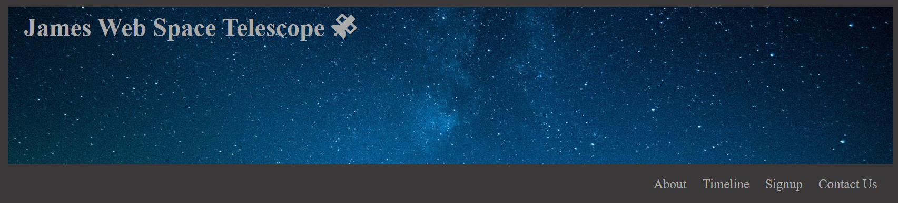
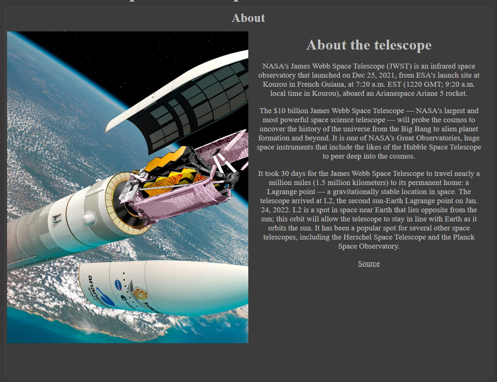
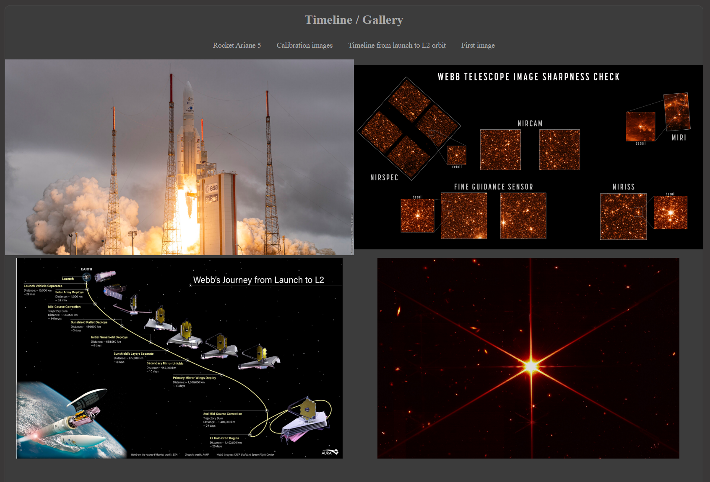
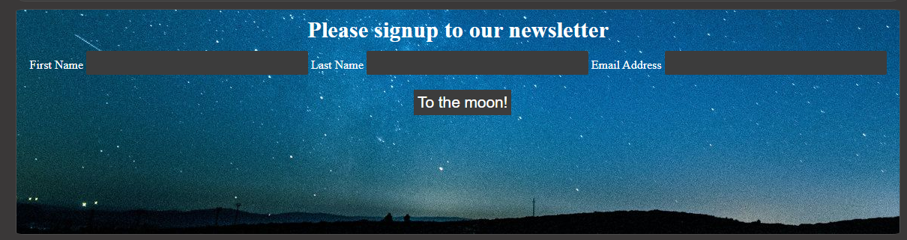
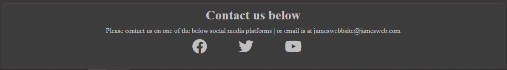
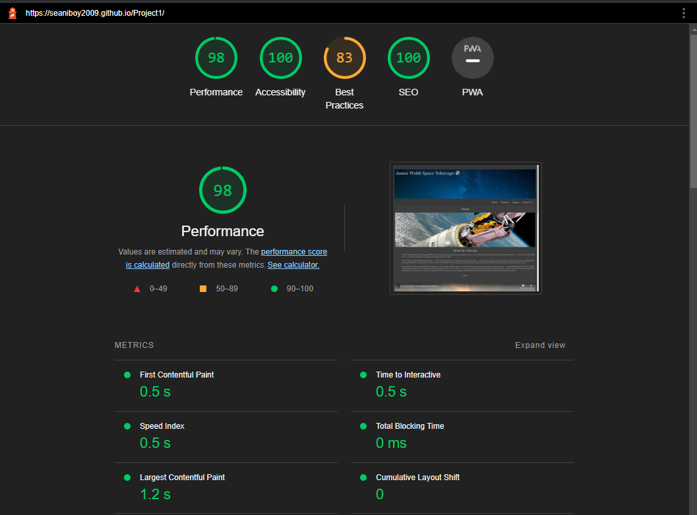
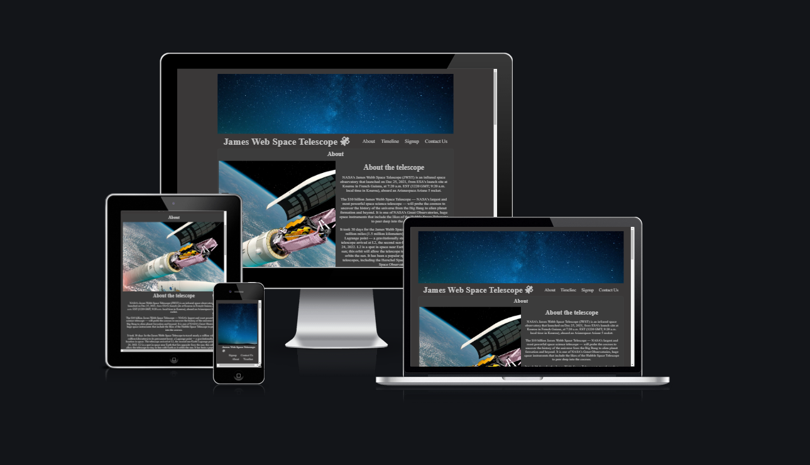

# James webb space telescope

The site is for enthusiastic children and adults who want to know about the new James webb space telescope. It provides information on the satellite as well as a timeline of events.

## User Stories

- __Stories__

    - I want to know about the telescope (About Section).
    - I want to see the first images (Timeline/Gallery Section).
    - I want to know more about this (Source link in about section, sign up form for newsletter).
    - I want to be able to contact the owner (Contact us section, with email and links to social media).
    - I want to see the craft being launched (about us section video of the launch).

## Features

- __navigation__

    - Name of the site/object to the left.
    - Navigation links to the right (about, timeline, sign-up, contact us).
    - Image of the night sky above.

- __About__

    - About general dates of the craft launch.
    - How much it has cost to design, build and launch.
    - How much time and distance it has travelled.

- __Timeline/Gallery__

    - How many days it look to arrive at its orbit location.
    - Image showing all the deployment stages during the 29days to its orbit.
    - First image as well as the calibration images.

- __Signup__

    - Form for signing up to a newsletter, a page to then confirm it has been successful.

- __Footer__

    - Email information as well as social media links.
    - Map to the launch location.

## Testing

I have tested my site for 3 resolutions, 2000px, 1200px and 720px, these resolutions are part of the responsiveness i have added to the CSS.
I have run the code through a html and css validation as well as lighthouse to make sure it is accessible for the impaired.

- __Code__
    - HTML
        - Tested html code though [W3C validator](https://validator.w3.org/nu/#textarea)
        - Formatted code with GitPod
    - CSS
         - Tested css code though [Jigsaw](https://jigsaw.w3.org/css-validator/validator)
         - Formatted code with GitPod

- __Bugs / Issues__

    - Had a lot of bugs with the margin and container when scaling up and down, it experimented a lot with % and margins to get it working and looking good.
    - Gitpod images for this document are not working on github
    - Text alignment and margins took me a while to fix and resolve for all sections, mostly so they looked nice

- Spell checking
    - [Online Spellchecker](https://www.online-spellcheck.com/)

- Lighthouse accessibility, the accessibility is not 100% because there is no text for the social icons, But there is not supposed to be otherwise this score would be 100%

- Responsiveness
    - Tested through the am i responsive [Am I Responsive](https://ui.dev/amiresponsive)
    - Tested using google's dev tools.
    - Tested on phones, iphone se, galaxy 8+ 

## Deployment

I have used GitHub and Gitpod to create and version control my project, I have also then used GitHub pages to deploy my project to a live environment [Live version](https://seaniboy2009.github.io/Project1/).

 - Deployment from Git pod to github using, git add, commit and push to github.
 - Deployment to live using github pages, settings on the project > pages > branch: main then save, allowing 5 minutes for the page to go live.

## Credits

- __References__

- media
    - Space.com - for images.
    - Google.com - for images.
    - Youtube.com - for launch video.

- Text/Information
    - Space.com - for information about the telescope.

- Text/Fonts
    - Fontawesome.com - for the font icons.
    - https://tailwindcss.com/docs/screen-readers - for hiding text for the social media links, but so its still accessable for screen-reader.