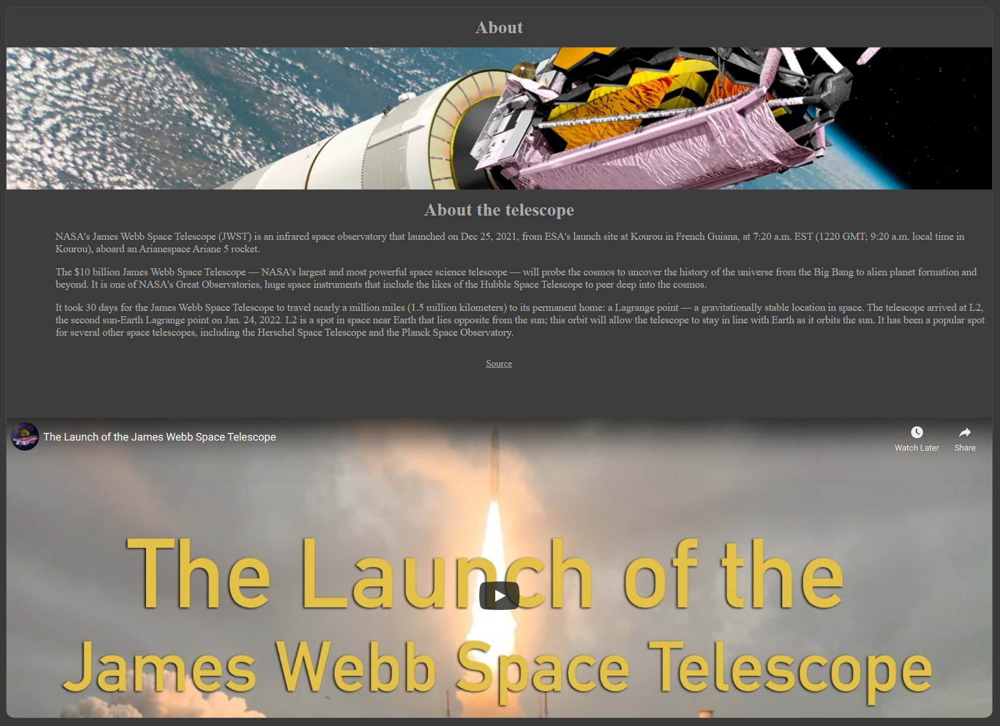

# James web space telescope

The site is for enthusiastic children and adults who want to know about the new James web space telescope. It provides informaion on the satalie as well as a timeline of events.

## Features

Name of the telescope as well as navigation bar top right, also a hero image of the night sky above.

## sections

- __navigation__

    - name of the site/object to the left.
    - navigation links to the right (about, timeline, sign-up, contact us)
    - image of the night sky above

- __About__

    - about general dates of the craft launch.
    - how much it has cost to design, build and launch.
    - how much time and distance it has traveled.

- __Timeline__

    - how many days it look to arrive at its orbit location
    - image showing all the deployment stages during the 29days to its orbit

- __First images__

    - how many days it look to arrive at its orbit location
    - image showing all the deployment stages during the 29days to its orbit

- __Signup__

    - how many days it look to arrive at its orbit location
    - image showing all the deployment stages during the 29days to its orbit

- __Footer__

    - email information as well as social media links.

## Deployment

I have used GitHub and Gitpod to create and version control my project, I have also then used GitHub pages to deploy my project to a live environment [Live version](https://seaniboy2009.github.io/Project1/).

## Testing

I have tested my site for 3 resolution, 2000px, 1200px and 720px, these resolutions are part of the responsiveness i have added to the CSS.

I have run the code though a html and css validation as well as lighthouse to make sure it is accessible for the impaired.

- HTML
  - Tested html code though [W3C validator](https://validator.w3.org/nu/#textarea)
- CSS
  - Tested css code though [Jigsaw](https://jigsaw.w3.org/css-validator/validator)

- Spellchecking
    - [Online Spellchecker](https://www.online-spellcheck.com/)

- Lighthouse accessablitly, the accessablity is not 100% because there is no text for the social icons, But there is not suposed to be otherwise this score would be 100%

- Responsiveness
    - Tested through the am i responsive [Am I Responsive](https://ui.dev/amiresponsive)

## Bugs / Issues

- __Issues__

    - Had a lot of bugs with the margin and container when scaling up and down, it to experiment a lot with with % and margins to get it working and looking good.
    
    - gitpod images for this document are not working on github

    - text alignment and margins took me a while to fix and resolve for all sections, mostly so they looked nice

## Credits

- __References__

- media
    - space.com - for images
    - google.com - for images

- Text/Information
    - space.com - for information about the telescope

- Text/Fonts
    - fontawesome.com - for the font icons